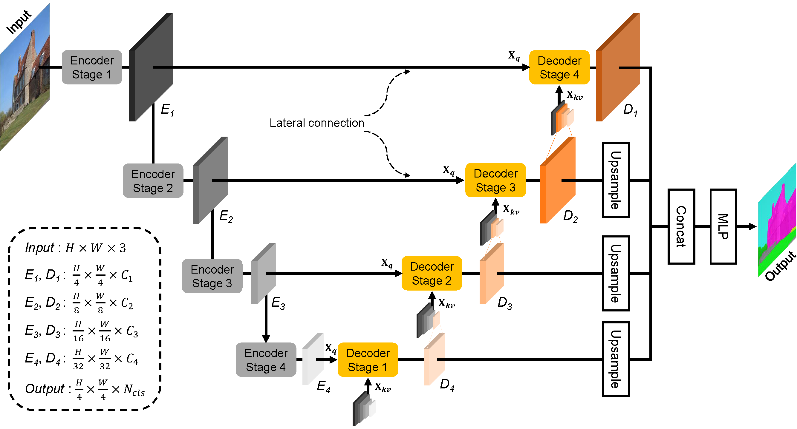
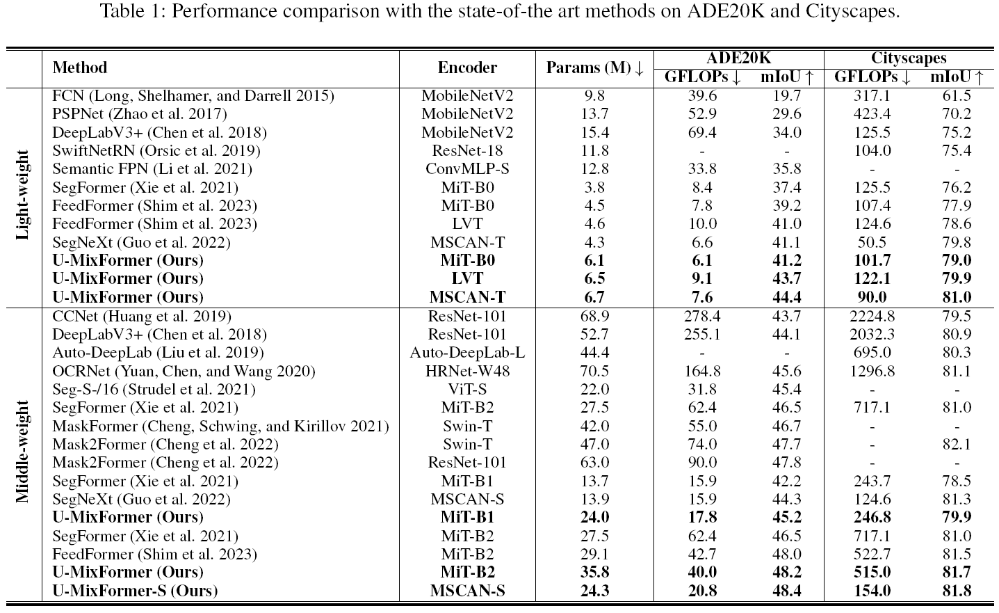

# U-MixFormer

## Introduction
<!-- 
### 🎉 U-MixFormer 🎉 -->

<!--  -->
<div align="center">
  
</div>
<p align="center">
  U-MixFormer architecture.
</p>

We propose a novel transformer decoder, U-MixFormer, built upon the U-Net structure, designed for efficient semantic segmentation. Our approach distinguishes itself from the previous transformer methods by leveraging lateral connections between encoder and decoder stages as feature queries for the attention modules, apart from the traditional reliance on skip connections.
Moreover, we innovatively mix hierarchical feature maps from various encoder and decoder stages to form a unified representation for keys and values, giving rise to our unique Mix-attention module.

<!--  -->
<div align="center">
  
</div>
<p align="center">
  Performance vs. computational efficiency on ADE20K (single-scale inference).
  U-MixFormer outperforms previous methods in all configurations.
</p>

## Installation

We use [MMSegmentation v1.0.0](https://github.com/open-mmlab/mmsegmentation/tree/v1.0.0) as the codebase.

For install and data preparation, please find the guidelines in [MMSegmentation v1.0.0](https://github.com/open-mmlab/mmsegmentation/tree/v1.0.0) for the installation and data preparation.

Environments are conducted on ```CUDA 11.0``` and  ```pytorch 1.13.0```

## Training

```
# Single-gpu training
python tools/train.py configs/umixformer/umixformer_mit-b0_8xb2-160k_ade20k-512x512.py

# Multi-gpu training
./tools/dist_train.sh configs/umixformer/umixformer_mit-b0_8xb2-160k_ade20k-512x512.py <GPU_NUM>
```

## Evaluation

<!-- Download pre-trained weights from [checkpoints](https://drive.google.com/drive/folders/1w72pQAsCFDxKn4oKGkG6YcsplChuKqf1?usp=drive_link). -->

All our models were trained using 2 A100 GPUs

Example: evaluate ```U-MixFormer-B0``` on ```ADE20K```:

```
# Single-gpu training
python tools/test.py configs/umixformer/umixformer_mit-b0_8xb2-160k_ade20k-512x512.py /path/to/checkpoint_file

# Multi-gpu training
./tools/dist_test.sh configs/umixformer/umixformer_mit-b0_8xb2-160k_ade20k-512x512.py /path/to/checkpoint_file <GPU_NUM>
```

## Qualitative Test (i.e. visualization)
### Visualization
```shell
python demo/image_demo.py ${IMAGE_FILE} ${CONFIG_FILE} ${CHECKPOINT_FILE} [--out-file ${OUTPUT_IMAGE_NAME}] [--device ${DEVICE_NAME}] [--palette-thr ${PALETTE}]
```

Example: visualize ```U-MixFormer-B0``` on ```cityscapes```: 

```shell
python demo/image_demo.py demo/demo.png configs/umixformer/umixformer_mit-b0_8xb1-160k_cityscapes-1024x1024.py \
/path/to/checkpoint_file --out-file demo/output.png --device cuda:0 --palette cityscapes
```
<!-- ### Zoom in the specific area (only for paper)
```shell
python paper/zoom_demo.py
```

### Make Figure No.1
Generate a SVG file
```shell
python paper/figure1.py
``` -->

## Onnx Model Conversion
Please first install mmdeploy in another folder and run on mmsegmentation folder
```shell
python /path/to/MMDEPLOY_PATH/tools/deploy.py ${DEPLOY_CONFIG_FILE} ${MODEL_CONFIG} ${CHECKPOINT_FILE} ${IMAGE_FILE} \
[--work-dir ${SAVE_FOLDER_NAME}] [--device ${DEVICE_NAME}] [--dump-info]
```

Example: Deploy ```U-MixFormer-B0``` on ADE20K into ONNX model: 

```shell
python /path/to/MMDEPLOY_PATH/tools/deploy.py ../mmdeploy/configs/mmseg/segmentation_onnxruntime_static-512x512.py \
configs/umixformer/umixformer_mit-b0_8xb2-160k_ade20k-512x512.py CHECKPOINT_FILE \
demo/demo.png \
--work-dir mmdeploy_model/umixformer_mit_b0_ade_512x512 \
--device cuda \
--dump-info
```

## Table
<!--  -->
<div align="center">
  
</div>
<p align="center">
  Performance comparison with the state-of-the art light-weight and middle-weight methods on ADE20K and Cityscapes
</p>

## Citation

<!-- If you find this project useful in your research, please consider cite:

```bibtex
@misc{mmseg2020,
    title={{MMSegmentation}: OpenMMLab Semantic Segmentation Toolbox and Benchmark},
    author={MMSegmentation Contributors},
    howpublished = {\url{https://github.com/open-mmlab/mmsegmentation}},
    year={2020}
}
``` -->

## License

This project is released under the [Apache 2.0 license](LICENSE).
